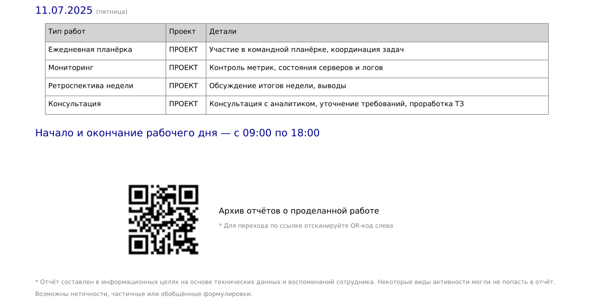

# 🧾 Work Report Generator
EN | [RU](README_ru.md)

**Work Report Generator** is a Python tool designed for automatically generating PDF work reports based on activity from GitLab, JIRA, Confluence, and Redmine.

It collects user actions for a specified period, groups them by day, adds additional activities (daily meetings, planning sessions, and retrospectives), visualizes statistics, and creates a PDF report. Optionally, the report can be automatically sent by email or uploaded to FTP.

---

## ⚙️ Minimum System Requirements

| Component        | Requirement                              |
|------------------|------------------------------------------|
| Python           | 3.9 or higher                            |
| Dependencies     | see [`requirements.txt`](/requirements.txt) or [`pyproject.toml`](/pyproject.toml) |
| Font             | `DejaVuSans.ttf` file for PDF (optional) |

---

## 📦 Installation

1. Clone the repository:
   ```bash
   git clone https://github.com/hawkab/work-report-generator.git
   cd work-report-generator
   ```

2. Install dependencies either via:
   ```bash
   pip install .
   ```

   Or:
   ```bash
   pip install -r requirements.txt
   ```

---

## 🛠 Configuration

1. Obtain API tokens for all used systems ([`GitLab`](https://specialistoff.net/question/773), [`Jira`](https://support.atlassian.com/atlassian-account/docs/manage-api-tokens-for-your-atlassian-account/), Confluence, [`Redmine`](https://www.redmine.org/boards/2/topics/53956/))

2. Optional: Obtain SMTP parameters for sending reports via email

3. Optional: Obtain FTP parameters for uploading reports to an FTP server

4. Create a `.env` file in the project root or in your home directory, based on the [`.env.example`](/.env.example) template:

   ```dotenv
   ...
   GITLAB_URL=https://gitlab.example.com
   GITLAB_TOKEN=your_gitlab_token
   GITLAB_USERNAME=username
   ...
   ```

5. Vacation settings 📆 (`vacations.json`)

If you did not work on certain days (e.g., vacation, sick leave, or day off), you can list these dates in the `vacations.json` file to:

- avoid generating static activity for those days;
- exclude them from the report;
- accurately reflect absence periods.

#### 📁 Location

The `vacations.json` file should be located in the project root.

#### 🧾 File Format

The file should be a JSON array of objects with `from` and `to` keys in `YYYY-MM-DD` format.

```json
[
  {
    "from": "2025-02-17",
    "to": "2025-02-21"
  },
  {
    "from": "2025-03-17",
    "to": "2025-03-21"
  }
]
```

> 🔄 If `from` and `to` are the same, it is considered a single-day absence.

---

## 🚀 Usage

### Generate a report for a specific period:

```bash
work-report --start 01.07.2025 --end 31.07.2025
```

### Generate and send the report via email and upload it to FTP:

```bash
work-report --start 01.07.2025 --end 31.07.2025 --email --ftp
```

---

## 📁 Output

- The PDF file will be saved in the working directory `./report_generator/reports`
- File name format: `work_report_YYYY-MM-DD_YYYY-MM-DD.pdf`
- [`Example report`](/report_generator/report_example/work_report_2025-07-07_2025-07-11.pdf)
- 
- 

---

## Additional Notes
- To view the report archive, you can use Google Drive or your own hosting with a [PHP script](https://github.com/hawkab/php-secure-report-viewer)
- To upload reports from `ftp` to Google Drive, you can use `rclone`:

1. Install rclone:
```bash
curl https://rclone.org/install.sh | sudo bash
```
2. Configure Google Drive:
```bash
rclone config
```
- n (new connection)
- name, e.g.: gdrive
- type: Google Drive
- complete browser authorization.
3. Copy files from FTP to Google Drive:

```bash
rclone copy ftpuser:password@ftp.example.com:/path gdrive:/Backup --progress
```

---

## 🤝 Acknowledgments

- [`python-dotenv`](https://github.com/theskumar/python-dotenv) — loading configuration from `.env` files.
- [`reportlab`](https://pypi.org/project/reportlab/) — PDF generation.
- [`qrcode`](https://pypi.org/project/qrcode/) — QR code generation.
- [`colorlog`](https://github.com/borntyping/python-colorlog) — colored log output in the terminal.
- [`python-redmine`](https://github.com/maxtepkeev/python-redmine) — interacting with Redmine via REST API.
- [`python-gitlab`](https://github.com/python-gitlab/python-gitlab) — interacting with GitLab API.
- [`pytest`](https://docs.pytest.org/) — for testing project components.

Many thanks to the authors of these libraries for their contribution to open source 💚

