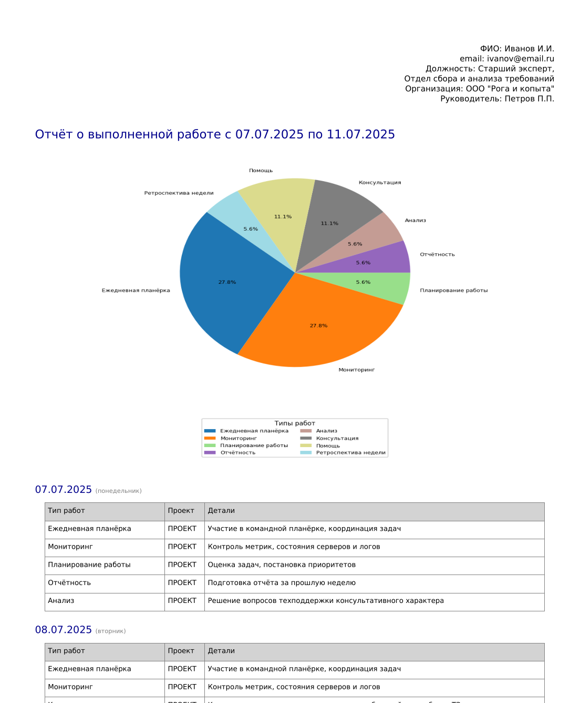
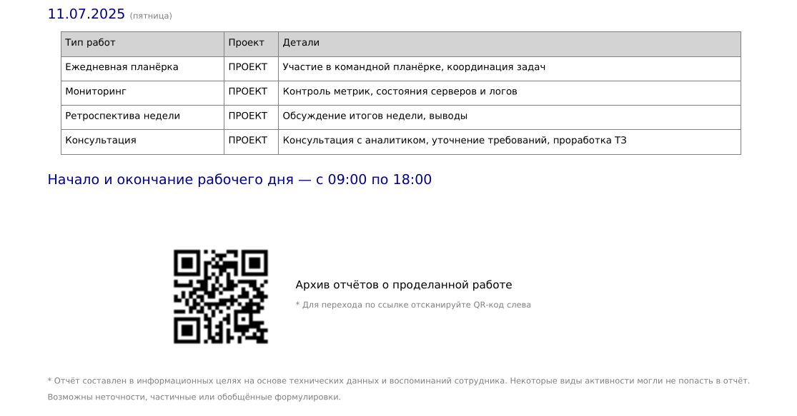

# 🧾 Work Report Generator
[EN](README.md) | RU

**Work Report Generator** — это инструмент на Python, предназначенный для автоматической генерации PDF-отчётов о проделанной работе на основе активности из GitLab, JIRA, Confluence и Redmine.

Он собирает действия пользователя за указанный период, группирует их по дням, добавляет дополнительные активности (дейлики, планирования и ретро), визуализирует статистику и формирует отчёт в виде PDF-файла. По желанию отчёт можно автоматически отправить по электронной почте или загрузить на FTP.

---

## ⚙️ Минимальные системные требования

| Компонент         | Требование                            |
|------------------|----------------------------------------|
| Python           | 3.9 или выше                           |
| Зависимости      | см. [`requirements.txt`](/requirements.txt) или [`pyproject.toml`](/pyproject.toml) |
| Шрифт            | Файл `DejaVuSans.ttf` для PDF (опционально) |

---

## 📦 Установка

1. Клонируйте репозиторий:
   ```bash
   git clone https://github.com/hawkab/work-report-generator.git
   cd work-report-generator
   ```

2. Установите зависимости так:
   ```bash
   pip install .
   ```

   Или так:
   ```bash
   pip install -r requirements.txt
   ```

---

## 🛠 Настройка

1. Получите API-токены для всех используемых систем ([`GitLab`](https://specialistoff.net/question/773), [`Jira`](https://support.atlassian.com/atlassian-account/docs/manage-api-tokens-for-your-atlassian-account/), Confluence, [`Redmine`](https://www.redmine.org/boards/2/topics/53956/))

2. Опционально: Получите параметры SMTP для отправки email (если требуется отправка на email отчётов)

3. Опционально: Получите параметры FTP (если требуется загрузка на ftp отчётов)

4. Создайте файл `.env` в корне проекта или в домашней директории, на основе шаблона [`.env.example`](/.env.example):

   ```dotenv
   ...
   GITLAB_URL=https://gitlab.example.com
   GITLAB_TOKEN=your_gitlab_token
   GITLAB_USERNAME=username
   ...
   ```
5. Настройка отпусков 📆 (`vacations.json`))

Если в определённые дни вы не работали (например, были в отпуске, на больничном или в отгуле), вы можете указать эти даты в файле `vacations.json`, чтобы:

- избежать генерации статической активности в эти дни;
- не включать их в отчёт;
- корректно отражать периоды отсутствия.

#### 📁 Расположение

Файл `vacations.json` должен находиться в корне проекта

#### 🧾 Формат файла

Файл представляет собой JSON-массив объектов с ключами `from` и `to` в формате `YYYY-MM-DD`.

```json
[
  {
    "from": "2025-02-17",
    "to": "2025-02-21"
  },
  {
    "from": "2025-03-17",
    "to": "2025-03-21"
  }
]
```

> 🔄 Если `from` и `to` совпадают, это считается однодневным отсутствием.

---

## 🚀 Использование

### Формирование отчёта за определённый период:

```bash
work-report --start 01.07.2025 --end 31.07.2025
```

### Формирование с отправкой отчёта по email и загрузкой на FTP:

```bash
work-report --start 01.07.2025 --end 31.07.2025 --email --ftp
```

---

## 📁 Результат

- PDF-файл будет сохранён в рабочей директории `./report_generator/reports`
- Название файла: `work_report_ГГГГ-ММ-ДД_ГГГГ-ММ-ДД.pdf`
- [`Пример отчёта`](/report_generator/report_example/work_report_2025-07-07_2025-07-11.pdf)
- 
- 
---

## 🤝 Благодарности

- [`python-dotenv`](https://github.com/theskumar/python-dotenv) — загрузка конфигурации из `.env` файлов.
- [`reportlab`](https://pypi.org/project/reportlab/) — генерация PDF-документов.
- [`qrcode`](https://pypi.org/project/qrcode/) — генерация QR-кодов.
- [`colorlog`](https://github.com/borntyping/python-colorlog) — цветной вывод логов в терминал.
- [`python-redmine`](https://github.com/maxtepkeev/python-redmine) — взаимодействие с Redmine через REST API.
- [`python-gitlab`](https://github.com/python-gitlab/python-gitlab) — работа с API GitLab.
- [`pytest`](https://docs.pytest.org/) — для тестирования компонентов проекта.

Огромное спасибо авторам этих библиотек за их вклад в open source 💚
